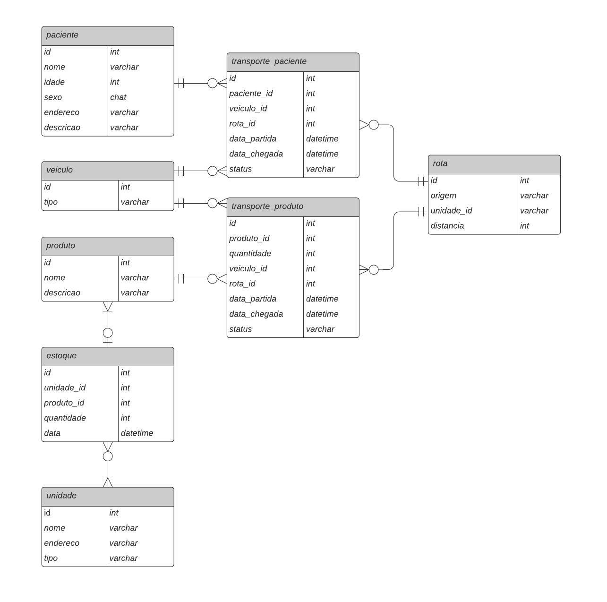
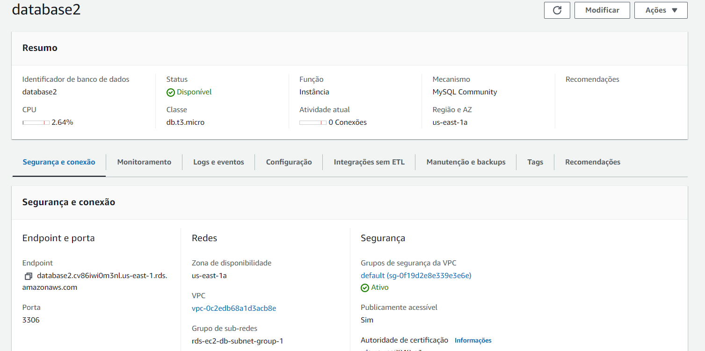
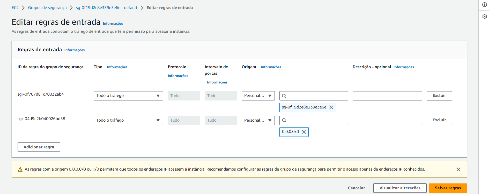
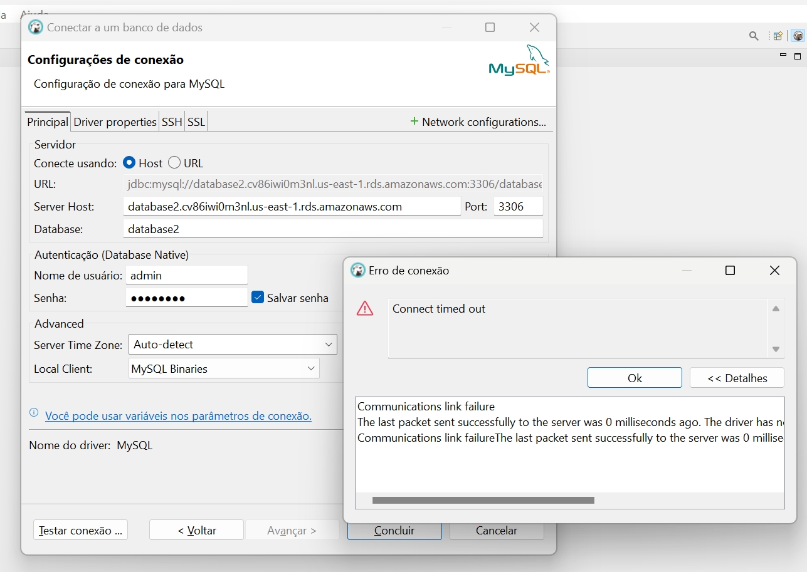
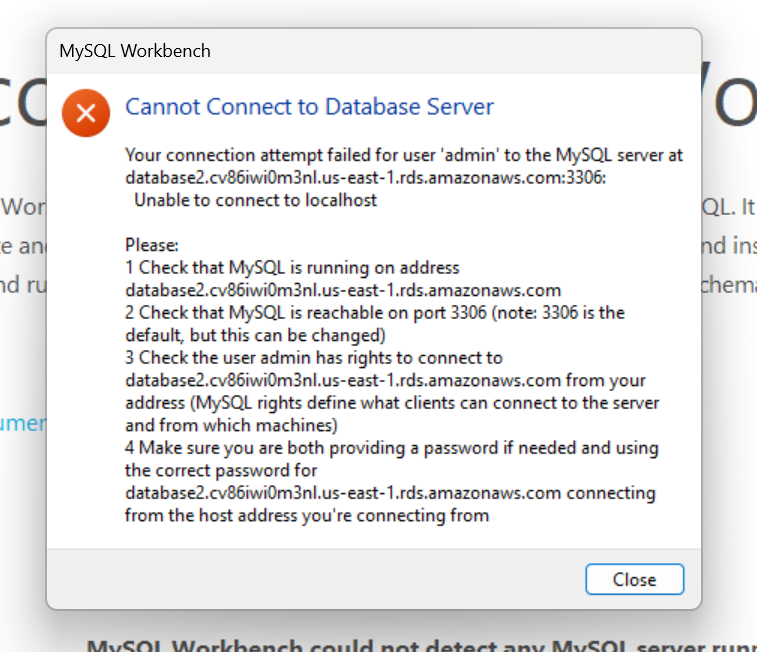
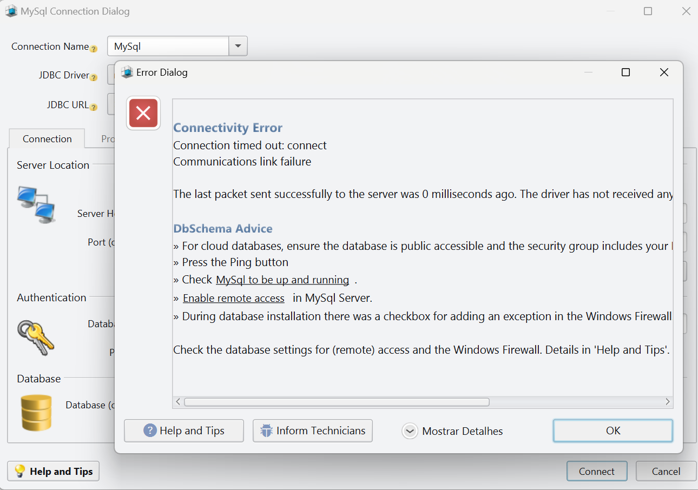
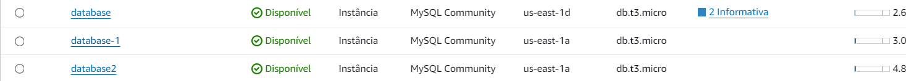

# Atividade ponderada da semana 3

## Modelo lógico

## RDS
Criei o RDS corretamente! Até mesmo com o auxílio deste vídeo quando tive dúvidas: https://www.youtube.com/watch?v=gCTOitR31Eg.

### Banco de dados

### Configurações do grupo de segurança

## Conexão com o banco de dados RDS
Neste momento, não consegui prosseguir. Sempre dá erro e fiz diversas tentativas em diferentes clientes de banco de dados: __MySQL Workbench__, __DBSchema__ e __DBeaver__. Tentei até com o docker como visto em sala de aula. Mas não obtive êxito...

### Tentativa 1 (DBeaver)

### Tentativa 2 (MySQL Workbench)

### Tentativa 3 (DBSchema)

## Criação de outros RDS
Como não consegui, criei novamente outros bancos de dados com RDS.

Nenhum funcionou...

## Conclusão
Queria muito ter continuado a atividade, mas não consegui e fiquei sem orientação, sem saber como prosseguir, porque nem os conteúdos na internet e IA ajudaram.

Validei o host, porta do MySQL (3306), o nome de usuario (usava sempre admin), a senha (usava sempre 12345678), nome do banco de dados (criei: database, database2 e database-1), firewall, VPC, configurei regras de entrada no security groups. Sem vitória.

Enfim, alémde não me conectar ao RDS, faltou criar as tabelas com comando SQL, inserir os dados e fazer a consulta... Seria a parte mais tranquila de se fazer.